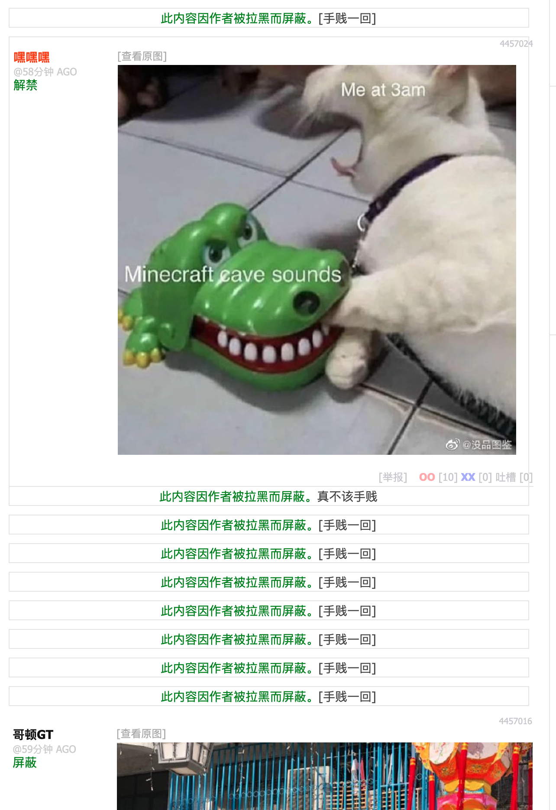

# Jandan.net 煎蛋网小工具扩展。
可用于Chrome， Firefox， Firefox手机版和Opera浏览器的扩展。理论上 Edge 也可以用，没有测试过。

## 安装
- ### Chrome 
  https://chrome.google.com/webstore/detail/%E7%85%8E%E8%9B%8B%E5%B7%A5%E5%85%B7%E7%AE%B1/fgjbjekhjapofhoecjgbheigggejnfle?utm_source=chrome-ntp-icon
- ### Firefox
  https://addons.mozilla.org/en-US/firefox/addon/jandantool/

## 功能
- ### 屏蔽某个ID的发言
  将屏蔽防伪码，而不是昵称（煎蛋网用户防伪码由其发言时候填写的邮箱计算得来）
  效果如图

  

  屏蔽后若想取消屏蔽，点击`解禁`即可

- ### 上传图片到微博直接获得地址

  此功能搬运自 [微博图床](https://github.com/suxiaogang/WeiboPicBed)。在此感谢。

  做了以下改动
  - 上传页面从弹出窗口改为新标签页以可以在Firefox 安卓版上运行
  - 删除全局弹出消息
  - 添加未登录文字提示
  - 删除捐赠链接
  - 删除修改扩展图标功能
  

